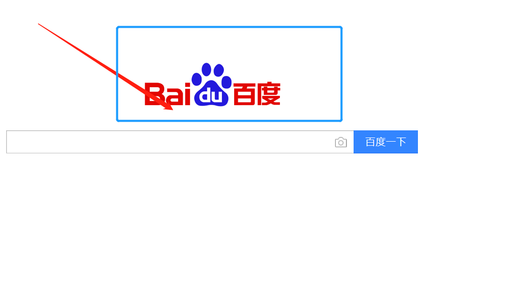

# demo2


## 链接demo


## 图片demo

    




## 引用demo
> 这是一个引文。
  
——出自《出处》  

多次引用。  

>>> 这是多重引文  


## 代码块demo  
- 行内代码  

这个代码中用来声明变量是`var a = 10`, 打印变量是`console.log`函数的调用。  


- 块式代码  

```
var a = 10:  
```